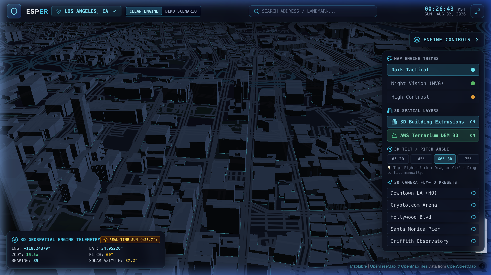
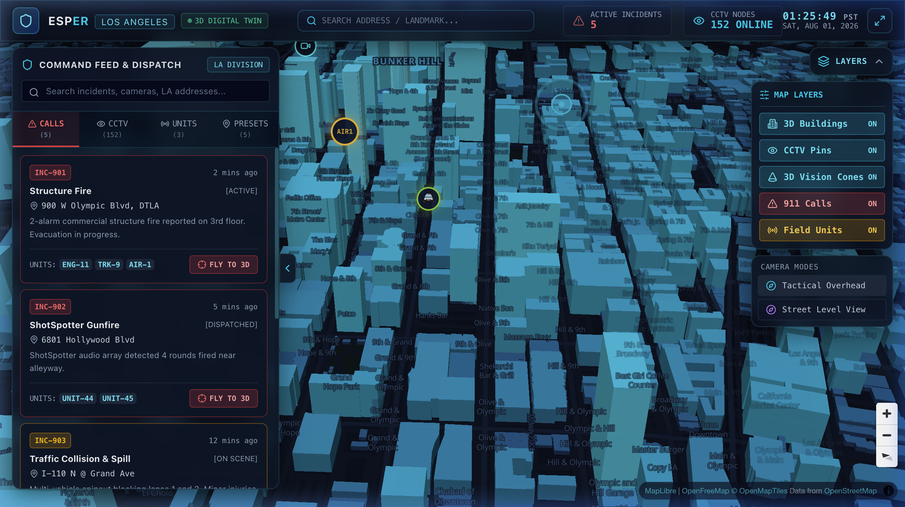
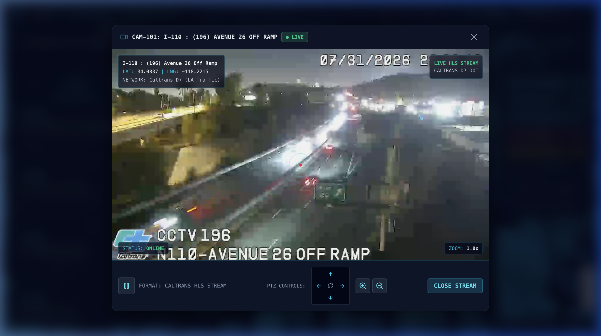

# ESPER ── 3D Geospatial Engine & Tactical Command Center

> **Blade Runner-inspired 3D geospatial mapping platform & tactical GIS command center powered by MapLibre GL JS, OpenFreeMap, AWS Terrarium DEM 3D elevation, real-time astronomical solar lighting, and multi-region telemetry.**

---

### 3D Geospatial Engine Viewport



---

### Public Safety Tactical Command Center



---

## Overview

**ESPER** is a high-performance 3D geospatial mapping platform and digital twin engine built with zero proprietary API key dependencies. ESPER streams vector tiles, height-graduated 3D building extrusions, high-resolution DEM terrain, real-time solar positioning, street & POI business labels, and live Caltrans HLS video feeds directly in the browser. 

The application architecture features a decoupled **3D Geospatial Engine (`src/engine/`)** that provides a pristine, zero-noise WebGL canvas for GIS analysis, multi-city exploration (9 U.S. Metro Regions), drag-and-drop spatial data ingestion (GeoJSON, KML, CSV), and custom tactical applications.

---

### Live Tactical Video Telemetry & PTZ Controls



---

## Key Features

- **🌐 Modular 3D Geospatial Engine Core (`src/engine/`)**: Clean, decoupled WebGL engine providing declarative layer management (`LayerManager`), marker lifecycle tracking (`MarkerManager`), map style switching (`StyleManager`), and spatial mathematics (`geoMath`).
- **🏙️ 9 Major U.S. Metro 3D Regions**: Instant HUD city switching with searchable, scrollable region selection and camera fly-to transitions across **Los Angeles**, **New York City**, **Chicago**, **Washington D.C.**, **Miami**, **San Francisco**, **Atlanta**, **Dallas-Fort Worth**, and **Seattle**.
- **☀️ Real-Time Astronomical Solar Lighting**: Calculates exact solar azimuth, altitude, and WebGL directional building lighting based on real clock time (`new Date()`) and map coordinates — updating live every 60 seconds.
- **🏷️ Street Names & POI Business Labels**: Vector line symbol rendering for street names, points of interest (landmarks, businesses), and place names with theme-matched color palettes and dedicated HUD toggle.
- **🏢 Height-Graduated 3D Building Extrusions**: Multi-tier height-based color ramps, vertical ambient occlusion gradients (`fill-extrusion-vertical-gradient`), and glowing skyscraper highlight layers (>50m).
- **📂 Drag-and-Drop Spatial Data Ingestion**: Drag any `.geojson`, `.kml`, or `.csv` file directly onto the 3D canvas. The engine parses spatial features, plots vector layers via `LayerManager`, and fits camera bounds automatically (`map.fitBounds`).
- **📐 3D Tilt & Pitch Controls**: Direct mouse/keyboard 3D tilt (Right-Click Drag or `Ctrl + Drag`) plus quick-angle HUD buttons (`0° 2D`, `45°`, `60° 3D`, `75°`).
- **📍 Spatial Click Inspector**: Click anywhere on the 3D map or building rooftops to inspect WGS84 GPS coordinates, elevation, and reverse-geocoded addresses with 1-click target pins.
- **🔍 Universal Global Address Search**: Worldwide geocoding powered by OpenStreetMap Nominatim with automatic regional fallback biasing.
- **⛰️ Elevation DEM Terrain**: Real 3D terrain elevation powered by AWS Terrarium DEM raster tiles (`1.3x` exaggeration).
- **📹 Live Caltrans HLS Feeds**: Direct HTTP Live Streaming (`.m3u8`) from District DOT traffic cameras with `hls.js` video playback and PTZ controls.
- **🎛️ Dual Workspace Modes**: Seamlessly toggle between **`CLEAN ENGINE CANVAS`** (Pristine 3D GIS Platform) and **`DEMO SCENARIO`** (Public Safety Command Center).

---

## Tech Stack

- **Frontend Core**: React 18 + Vite 6
- **Styling**: Tailwind CSS v4 + Glassmorphism HUD Design System
- **3D Map Engine**: MapLibre GL JS 5.1
- **Tile Architecture**: OpenFreeMap Vector Tiles + AWS Terrarium DEM
- **Video Decryption**: HLS.js (`.m3u8` HTTP Live Streaming)
- **Geocoding API**: OpenStreetMap Nominatim
- **Spatial Parsers**: `togeojson` (KML parsing), custom CSV geoparser
- **Icons**: Lucide React

---

## Getting Started

### Prerequisites

- **Node.js**: `v18.0.0` or higher
- **npm**: `v9.0.0` or higher

### Installation

```bash
# Clone the repository
git clone https://github.com/ericmaddox/ESPER.git

# Navigate to project directory
cd ESPER

# Install dependencies
npm install
```

### Local Development

Launch the development server:

```bash
npm run dev
```

Open your browser and navigate to `http://localhost:5173`.

### Production Build

Compile the production-ready bundle:

```bash
npm run build
```

Preview the production build locally:

```bash
npm run preview
```

---

## Architecture & Project Structure

```
ESPER/
├── docs/
│   ├── hero-map.png             # Main 3D viewport screenshot
│   ├── engine-canvas.png        # 3D Geospatial Engine canvas screenshot
│   └── camera-stream-modal.png  # Live HLS CCTV stream modal screenshot
├── src/
│   ├── engine/                  # 🌐 Modular 3D Geospatial Engine Core
│   │   ├── core/
│   │   │   ├── EngineViewport.jsx # WebGL MapLibre 3D viewport orchestrator
│   │   │   ├── LayerManager.js   # Declarative GeoJSON, 3D extrusions & labels manager
│   │   │   ├── MarkerManager.js  # Safe DOM marker & popup lifecycle manager
│   │   │   └── StyleManager.js   # Map style themes (Dark Tactical, NVG, High Contrast)
│   │   ├── math/
│   │   │   ├── geoMath.js        # Spatial math (geodesic circles, FOV cones, distance)
│   │   │   └── solarMath.js      # Astronomical solar position algorithm (azimuth/altitude)
│   │   ├── services/
│   │   │   └── geocodingService.js # OpenStreetMap Nominatim spatial search API
│   │   ├── hooks/
│   │   │   └── useEngine.js      # React hook interface for engine controls
│   │   └── index.js              # Core engine barrel exports
│   ├── components/
│   │   ├── CleanEngineCanvas.jsx # Pristine, zero-noise 3D geospatial canvas UI
│   │   ├── DragDropOverlay.jsx   # Drag-and-drop spatial file dropzone overlay (GeoJSON, KML, CSV)
│   │   ├── EngineToolbar.jsx     # Engine controls (Terrain, 3D extrusions, labels, themes, tilt)
│   │   ├── Header.jsx           # Top HUD navbar with workspace mode & region switcher
│   │   ├── RegionSelector.jsx   # Searchable, scrollable multi-city region selector
│   │   ├── AddressSearch.jsx    # Universal global address geocoding search bar
│   │   ├── MapView.jsx          # Demo scenario 3D map viewport
│   │   ├── CommandSidebar.jsx   # Tactical dispatch panel & search
│   │   ├── LayerToolbar.jsx     # Collapsible tactical map layer toggles & presets
│   │   └── VideoFeedModal.jsx   # HLS .m3u8 video player & PTZ controls
│   ├── data/
│   │   └── mockData.js          # 9 U.S. metro regions, 40+ camera presets & mock telemetry
│   ├── App.jsx                  # Main application orchestrator & workspace mode state
│   ├── index.css                # Global styles, glassmorphism, scrollbars & HUD overlays
│   └── main.jsx                 # Application entrypoint
├── index.html                   # HTML shell & font definitions
├── vite.config.js               # Vite build configuration
└── package.json                 # Project dependencies & scripts
```

---

## Live Data Sources

| Data Stream | Provider | Format | Authentication |
|---|---|---|---|
| **Vector Tiles** | OpenFreeMap | OpenMapTiles Protocol | None (Open Source) |
| **Terrain DEM** | AWS Open Data | Terrarium PNG DEM | None (Public Domain) |
| **CCTV Video** | Caltrans District 7 | HLS (`.m3u8`) | None (Public DOT) |
| **Address Search** | OpenStreetMap | Nominatim Geocoding API | None (Open Source) |

---

## License

Distributed under the MIT License. See `LICENSE` for more information.
